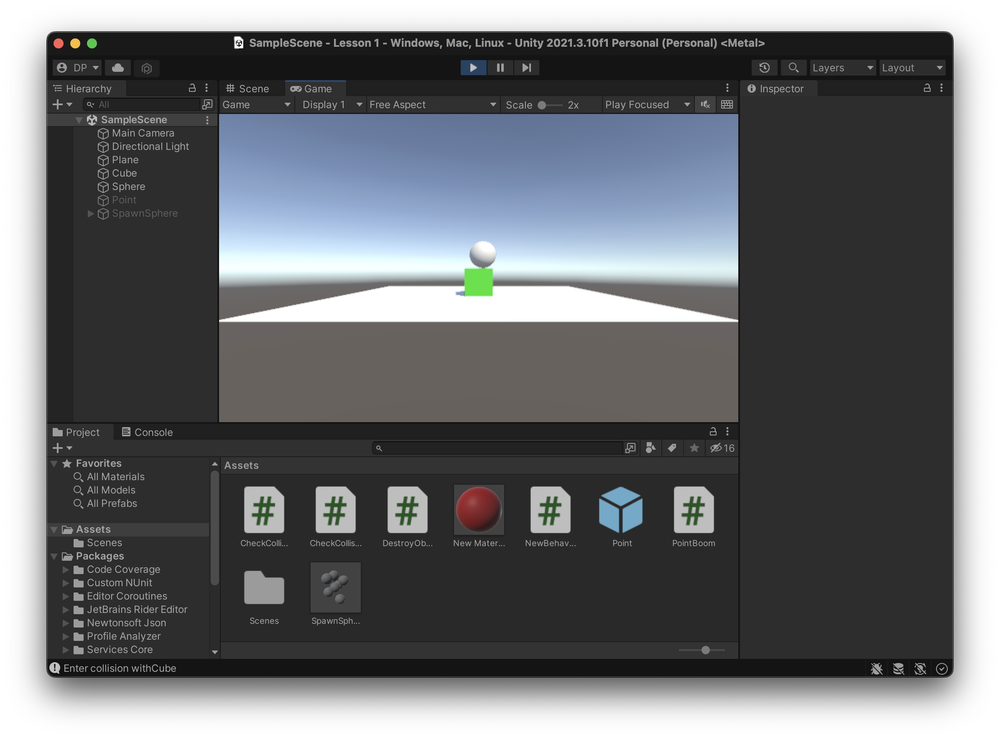
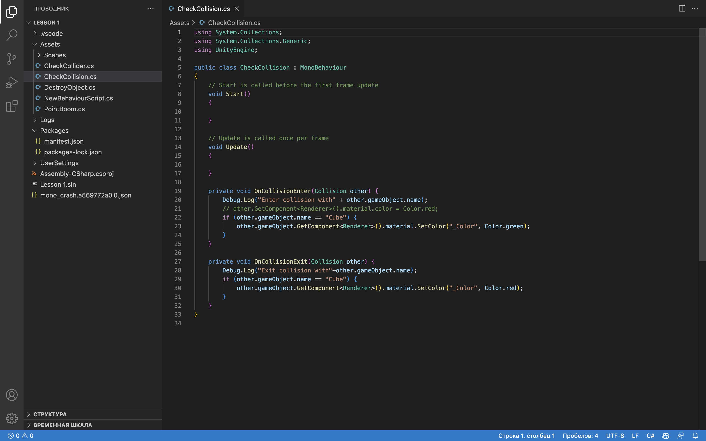
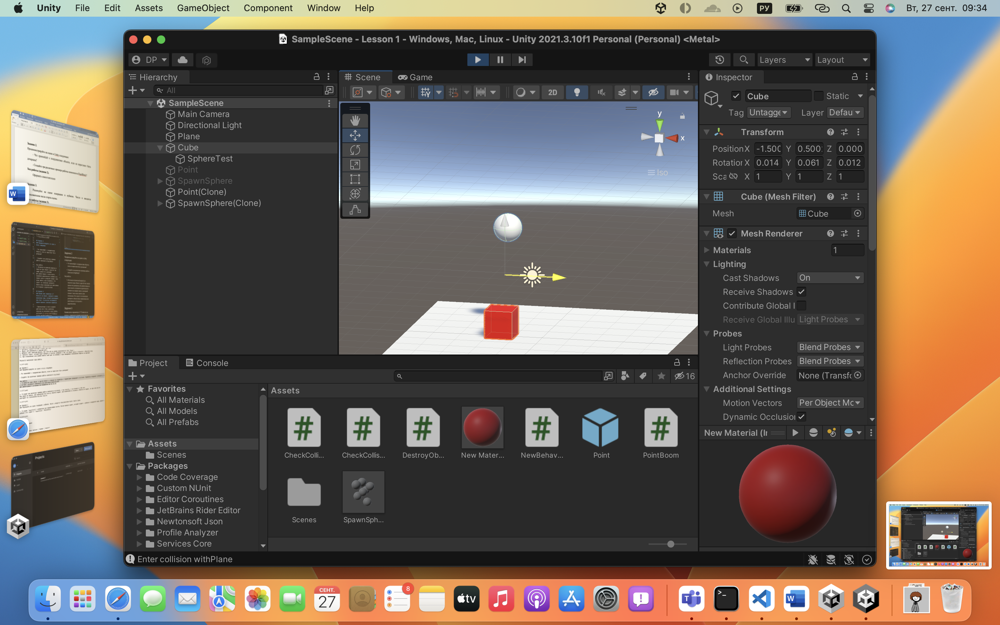
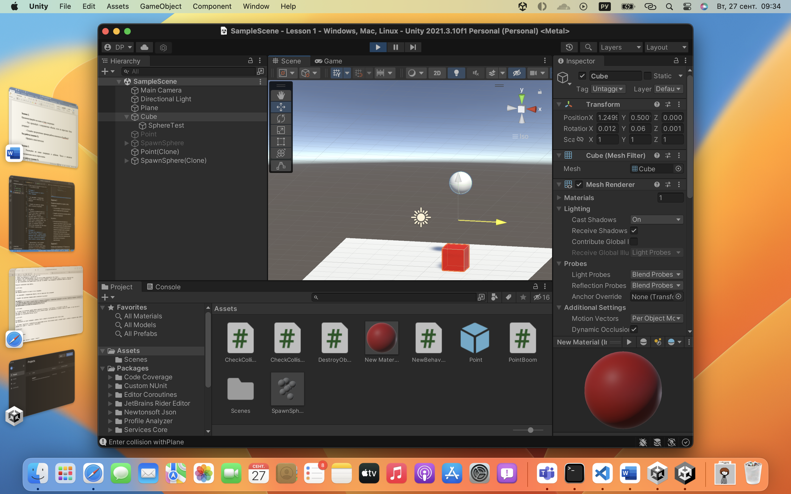
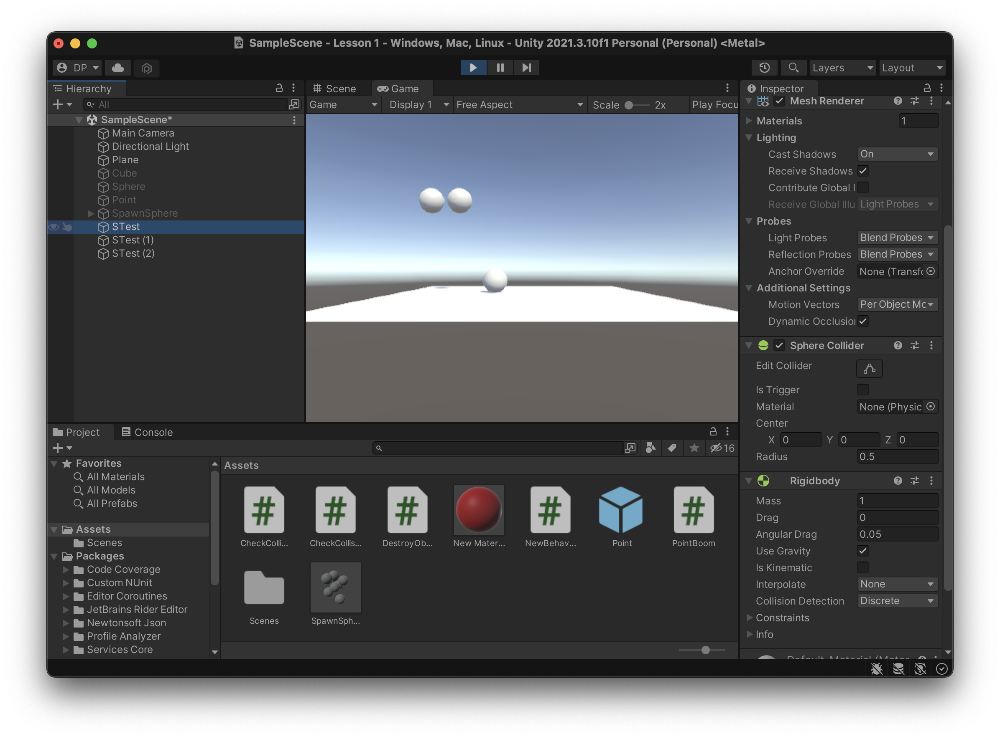
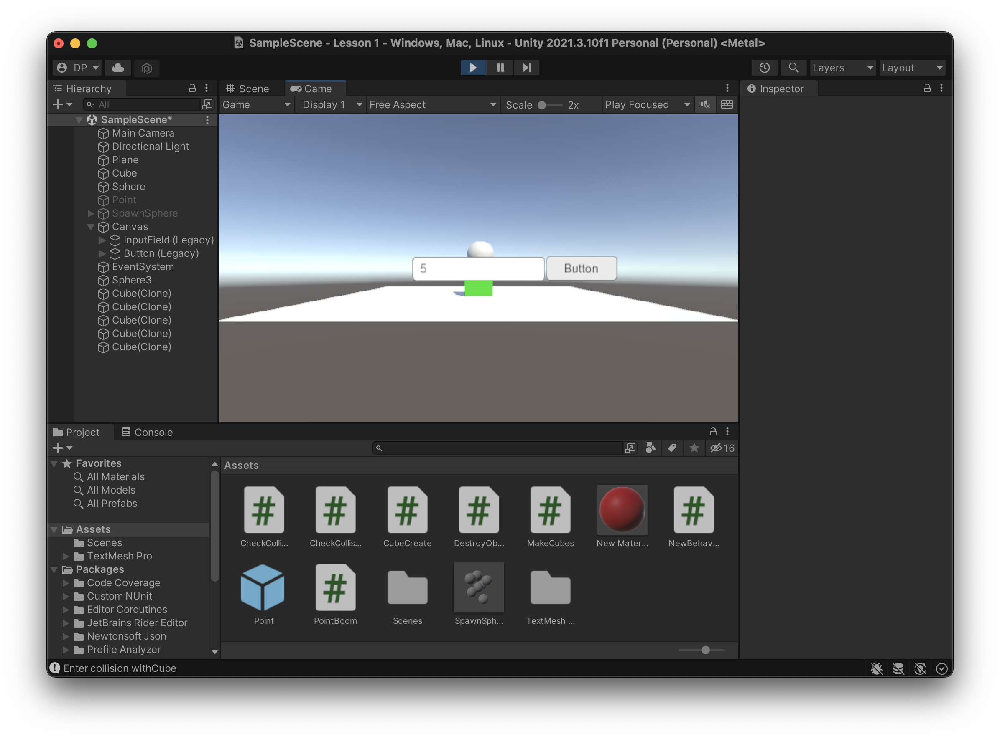

# АНАЛИЗ ДАННЫХ И ИСКУССТВЕННЫЙ ИНТЕЛЛЕКТ [in GameDev]
Отчет по лабораторной работе #1 выполнил(а):
- Попенко Даниила Геннадьевича
- РИ000024
Отметка о выполнении заданий (заполняется студентом):

| Задание | Выполнение | Баллы |
| ------ | ------ | ------ |
| Задание 1 | * | 60 |
| Задание 2 | * | 20 |
| Задание 3 | * | 20 |

знак "*" - задание выполнено; знак "#" - задание не выполнено;

Работу проверили:
- к.т.н., доцент Денисов Д.В.
- к.э.н., доцент Панов М.А.
- ст. преп., Фадеев В.О.

Структура отчета

- Данные о работе: название работы, фио, группа, выполненные задания.
- Цель работы.
- Задание 1.
- Код реализации выполнения задания. Визуализация результатов выполнения (если применимо).
- Задание 2.
- Код реализации выполнения задания. Визуализация результатов выполнения (если применимо).
- Задание 3.
- Код реализации выполнения задания. Визуализация результатов выполнения (если применимо).
- Выводы.
- ✨Magic ✨

## Цель работы
Настройть необходимое программное окружения. Ознакомиться с основными возможностями Unity и взаимодействием с объектами внутри встроенного редактора.

## Задание 1
### Пошагово выполнить каждый пункт раздела "ход работы" с описанием и примерами реализации задач
Ход работы:
1. Создать новый проект из шаблона 3D-Core.
2. Проверить, что настроена интеграция редактора Unity и Visual Studio Code.
3. Создать объект `Plane`;
4. Создать объект `Cube`;
5. Создать объект `Sphere`;
6. Установить компонент `Sphere Collider` для объекта Sphere;
7. Настроить `Sphere Collider` в роли триггера;
8. Объект куб перекрасить в красный цвет;
9. Добавить кубу симуляцию физики, при этом куб не должен проваливаться под `Plane`;
10. Написать скрипт, который будет выводить в консоль сообщение о том, что объект Sphere столкнулся с объектом Cube;
11. При столкновении Cube должен менять свой цвет на зелёный, а при завершения столкновения обратно на красный.

Результат выполнения хода работы:

## Задание 2
### Продемонстрируйте на сцене в Unity следующее:

- Что произойдёт с координатами объекта, если он перестанет быть дочерним?

- Создайте три различных примера работы компонента RigitBody?

Ход работы:
1. Используя встроенный редактор я поместил один объект в другой тем самым сделал его дочерним.
Для демонстрации я начал менять положение родительского элемента на экране сцены и дочерний элемент тоже начал менять свое положение. Это значит что положение дочернего объекта было зависимым или релятивным по отношнию к родительскому. Когда я отвязал один объект от другого то передвигая один объект положение другого не менялось.

2. Я добавил 3 объекта Sphere которые различались по свойствам RigitBody, с Use Gravity, с Is Kinematic и без них.
При включенном Use Gravity объекты падают вниз, при включенном Is Kinematic объекты зафиксированы в воздухе, но при этом они не реагируют на столкновения.

## Задание 3
### Реализуйте на сцене генерацию n кубиков. Число n вводится пользователем после старта сцены.

1. Я использовал `InputField` и `Button`. Написал небольшой скрипт по созданию обьектов и добавил его к `InputField`. Все получилось!

## Выводы

Я впервые поработал с Unity и сделал задание, мне очень понравилось.

| Plugin | README |
| ------ | ------ |
| Dropbox | [plugins/dropbox/README.md][PlDb] |
| GitHub | [plugins/github/README.md][PlGh] |
| Google Drive | [plugins/googledrive/README.md][PlGd] |
| OneDrive | [plugins/onedrive/README.md][PlOd] |
| Medium | [plugins/medium/README.md][PlMe] |
| Google Analytics | [plugins/googleanalytics/README.md][PlGa] |

## Powered by

**BigDigital Team: Denisov | Fadeev | Panov**
