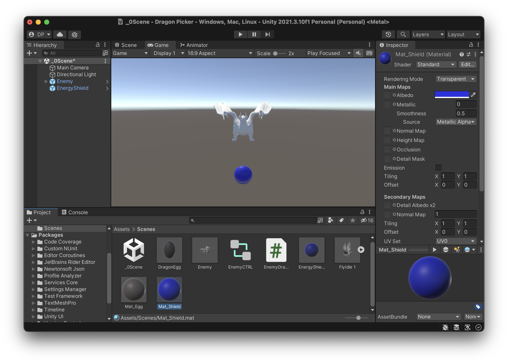
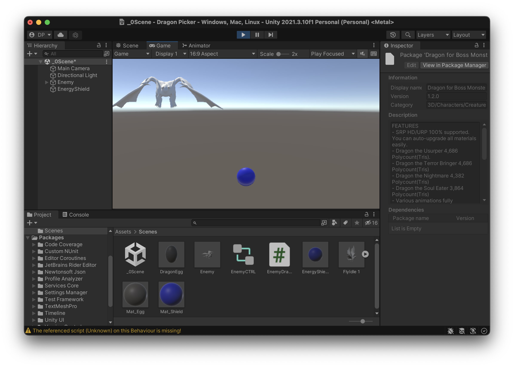
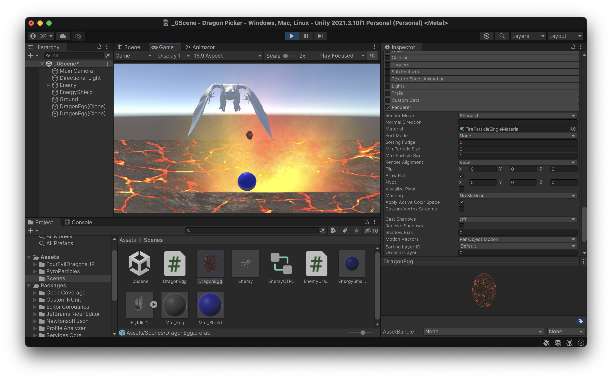
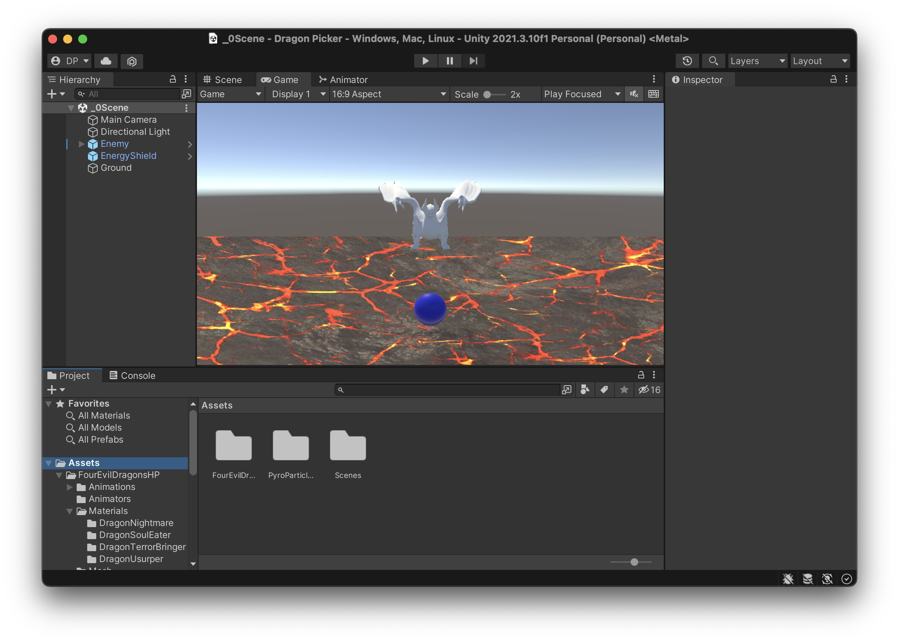
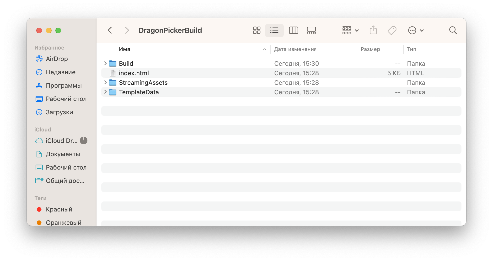
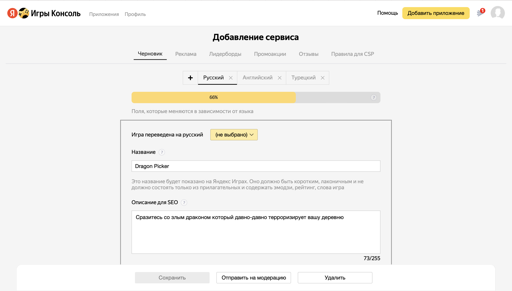

# Интерактивные сервисы
Отчет по лабораторной работе #2 выполнил(а):
- Попенко Даниил Геннадьевич
- Школа Икс (4-ый курс)

Отметка о выполнении заданий (заполняется студентом):

| Задание | Выполнение | Баллы |
| ------ | ------ | ------ |
| Задание 1 | * | 60 |
| Задание 2 | * | 20 |
| Задание 3 | * | 20 |

знак "*" - задание выполнено; знак "#" - задание не выполнено;

Работу проверили:
- к.т.н., доцент Денисов Д.В.
- к.э.н., доцент Панов М.А.
- ст. преп., Фадеев В.О.

[](https://nodesource.com/products/nsolid)

[](https://travis-ci.org/joemccann/dillinger)

Структура отчета

- Данные о работе: название работы, фио, группа, выполненные задания.
- Цель работы.
- Задание 1.
- Код реализации выполнения задания. Визуализация результатов выполнения (если применимо).
- Задание 2.
- Код реализации выполнения задания. Визуализация результатов выполнения (если применимо).
- Задание 3.
- Код реализации выполнения задания. Визуализация результатов выполнения (если применимо).
- Выводы.
- ✨Magic ✨

## Цель работы
Создание интерактивного приложения и изучение принципов
интеграции в него игровых сервисов.

## Задание 1
По теме видео практических работ 1-5 повторить реализацию игры на Unity.
Привести описание выполненных действий.

Выполнено:
- Первоначальная настройка сцены и игровой камеры. (Из-за синзронизации iCloud временно пропала текстура, я это дальше исправлю)


- Настройка движения дракона. Теперь он двигается в обе стороны, случайно меняя направление время от времени.



- Теперь дракон сбрасывает яйца, генерирующиеся из префаба DragonEgg.


Скрипт для дракона:

```csharp

using System.Collections;
using System.Collections.Generic;
using UnityEngine;

public class EnemyDragon : MonoBehaviour
{
    public GameObject dragonEggPrefab;
    public float speed = 1;
    public float timeBetweenEggDrops = 1f;
    public float leftRightDistance = 10f;
    public float chanceDiraction = 0.1f;

    void Start() {
        Invoke("DropEgg", 3f);  
    }

    void DropEgg() {
        Vector3 myVector = new Vector3(0.0f, 5.0f, 0.0f);
        GameObject egg = Instantiate<GameObject>(dragonEggPrefab);
        egg.transform.position = transform.position + myVector;
        Invoke("DropEgg", timeBetweenEggDrops);
    } 

    // Update is called once per frame
    void Update()
    {
        Vector3 pos = transform.position;
        pos.x += speed * Time.deltaTime;
        transform.position = pos;

        if (pos.x < -leftRightDistance) {
            speed = Mathf.Abs(speed);
    
        }
        else if (pos.x > leftRightDistance) {
            speed = -Mathf.Abs(speed);
    
        }
    }

    private void FixedUpdate() {
        if (Random.value < chanceDiraction) {
            speed *= -1;
        }
    }

}

```

- Добавил объект Plane и текстуру для драконьего яйца.



- Теперь падающие на Plane яйца взрываются (при соприкосновении с Plane исчезают, на их месте появляется анимация взрыва; яйца пропадают по достижении минимального значения по y).


Скрипт DragonEgg:

```csharp

using System.Collections;
using System.Collections.Generic;
using UnityEngine;

public class DragonEgg : MonoBehaviour
{
    public static float bottomY = -30f;
    void Start()
    {
        
    }

    private void OnTriggerEnter(Collider other) {
        ParticleSystem ps = GetComponent<ParticleSystem>();
        var em = ps.emission;
        em.enabled = true;

        Renderer rend;
        rend = GetComponent<Renderer>();
        rend.enabled = false;
    }

    // Update is called once per frame
    void Update()
    {
        if (transform.position.y < bottomY) {
            Destroy(this.gameObject);
        }
    }
}

```

Скрипт для сферы DragonPicker:

```csharp

using System.Collections;
using System.Collections.Generic;
using UnityEngine;

public class DragonPicker : MonoBehaviour
{
    public GameObject energyShieldPrefab;
    public int numEnergyShield = 3;
    public float energyShieldBottomY = -6f;
    public float energyShieldRadius = 1.5f;
    void Start()
    {
        for (int i = 1; i <= numEnergyShield; i++) {
            GameObject tShieldGo = Instantiate<GameObject>(energyShieldPrefab);
            tShieldGo.transform.position = new Vector3(0, energyShieldBottomY, 0);
            tShieldGo.transform.localScale = new Vector3(1*i,1*i,1*i);
        }
        
    }

    // Update is called once per frame
    void Update()
    {
        
    }
}

```


## Задание 2
В проект, выполненный в предыдущем задании, добавить систему проверки
того, что SDK подключен (доступен в режиме онлайн и отвечает на запросы);

Выполнено:
- Собранный на WebGL проект.


- Яндекс Игры Dragon Picker.


## Задание 3
Реферат:
1) Произвести сравнительный анализ игровых сервисов **Яндекс Игры**
и **VK Game**:
- MAU(Ежемесячное число пользователей) **VK Game**: 10 млн. и **Яндекс Игры**: 11 млн. Можно сказать что размер сопоставим
- Оба сервиса предоставляют возможность бесплатного продвижения
- Оба сервиса предоставляют возможность монетизации загружаемой игры
- **VK Game** не предоставляет хостинг для проекта, тогда как **Яндекс Игры** дают такую возможность.
- Интеграция **VK Game** и **Яндекс Игры** имеют собственные библиотки для интеграции в платформу: у Яндекса это SDK Яндекс Игр, у VK Games это VK Bridge.

2) Описать их методы интеграции с Unity:
- Яндекс Игры возволяет интегрировать проект Unity на платформу с помощью удобного плагина который разработан сторонним разработчиком; в VK Game также можно интегрировать проект с помощью плагина, однако он тоже разработан сторонними разрабочиками и работает через библиотеку VK Bridge.

## Выводы

В ходе выполнения второй лабораторной работы я начал разработку собственной игры,я научился добавлять ассетами из Assets Store, управлять поведением объектов и генерировать их с помощью C# скриптов. Также я научился собирать проект Unity, интегрировать его c SDK Яндекса.

| Plugin | README |
| ------ | ------ |
| Dropbox | [plugins/dropbox/README.md][PlDb] |
| GitHub | [plugins/github/README.md][PlGh] |
| Google Drive | [plugins/googledrive/README.md][PlGd] |
| OneDrive | [plugins/onedrive/README.md][PlOd] |
| Medium | [plugins/medium/README.md][PlMe] |
| Google Analytics | [plugins/googleanalytics/README.md][PlGa] |

## Powered by

**BigDigital Team: Denisov | Fadeev | Panov**